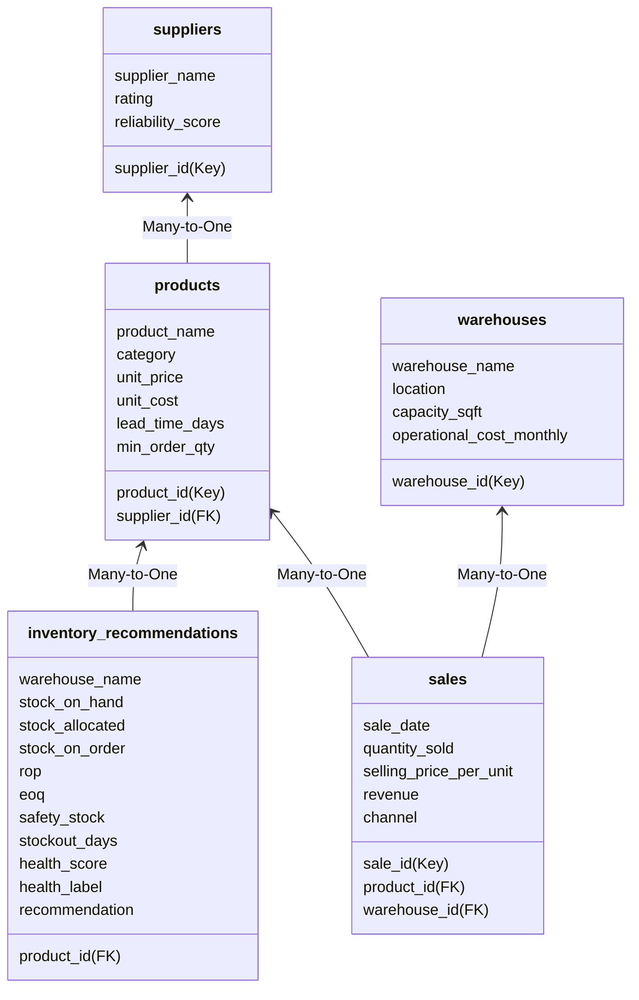

# Power BI Dashboard Engineering & DAX Specification
*Inventory Performance & Stock Optimization Platform*

This document outlines the database modeling, DAX measurements, and layout specifications required to build a corporate-grade interactive dashboard in Power BI.

---

## 1. Data Model & Relationships (Star Schema)

Import all processed CSV files from the `data/processed/` folder. Arrange them in a **Star Schema** centered on the transactional fact tables.



### Relationship Cardinality Check
* `products` [product_id] `1` ---- `*` `sales` [product_id] (Active, Single direction)
* `warehouses` [warehouse_id] `1` ---- `*` `sales` [warehouse_id] (Active, Single direction)
* `suppliers` [supplier_id] `1` ---- `*` `products` [supplier_id] (Active, Single direction)
* `products` [product_id] `1` ---- `*` `inventory_recommendations` [product_id] (Active, Both directions)

---

## 2. Core DAX Calculations (Calculated Columns & Measures)

Create a dedicated table named `_Measures` and implement the following DAX calculations:

### Base Revenue Metrics
```dax
Total Revenue = SUM(sales[revenue])
```
```dax
Total Quantity Sold = SUM(sales[quantity_sold])
```
```dax
Average Order Value = DIVIDE([Total Revenue], COUNTROWS(sales))
```

### Inventory Valuation & COGS
```dax
Total Cost of Goods Sold (COGS) = SUMX(sales, sales[quantity_sold] * RELATED(products[unit_cost]))
```
```dax
Total Profit Margin = [Total Revenue] - [Total Cost of Goods Sold (COGS)]
```
```dax
Profit Margin % = DIVIDE([Total Profit Margin], [Total Revenue], 0)
```
```dax
Current Inventory Value = SUMX(inventory_recommendations, inventory_recommendations[stock_on_hand] * RELATED(products[unit_cost]))
```

### Operational Supply Chain Metrics
```dax
Inventory Turnover Ratio (ITR) = DIVIDE([Total Cost of Goods Sold (COGS)], [Current Inventory Value], 0)
```
```dax
Days Inventory Outstanding (DIO) = DIVIDE([Current Inventory Value] * 365, [Total Cost of Goods Sold (COGS)], 0)
```
```dax
Stockout Alert Count = COUNTROWS(FILTER(inventory_recommendations, inventory_recommendations[stock_on_hand] = 0))
```
```dax
Reorder Trigger Count = COUNTROWS(FILTER(inventory_recommendations, inventory_recommendations[stock_on_hand] < inventory_recommendations[rop] && inventory_recommendations[stock_on_order] = 0))
```
```dax
Average Supplier Reliability = AVERAGE(suppliers[reliability_score])
```

### Advanced DAX: ABC Classification (Calculated Table or Dynamic Column)
```dax
ABC Class Column = 
VAR TotalSalesVal = CALCULATE(SUM(sales[revenue]), ALL(products))
VAR CurrentSKUSales = CALCULATE(SUM(sales[revenue]))
VAR CumulativeTable = 
    ADDCOLUMNS(
        ALL(products),
        "RunningRevenue", CALCULATE(SUM(sales[revenue]), FILTER(ALL(products), SUM(sales[revenue]) >= CurrentSKUSales))
    )
VAR RunningRevVal = MINX(FILTER(CumulativeTable, [product_id] = products[product_id]), [RunningRevenue])
VAR Share = DIVIDE(RunningRevVal, TotalSalesVal, 0)
RETURN
    IF(Share <= 0.70, "A", IF(Share <= 0.90, "B", "C"))
```

---

## 3. Page Layouts & Wireframes

### Page 1: Executive Summary
* **KPI Cards**: Total Revenue, Gross Profit Margin %, Average Order Value, Days Inventory Outstanding.
* **Top-Right Filters**: Warehouse, Category, Sales Channel.
* **Left Section**: Line Chart showing *Monthly Revenue Trend* (X-axis: Date, Y-axis: Total Revenue).
* **Right Section**: Bar Chart showing *Revenue by Category* (X-axis: Category, Y-axis: Total Revenue).
* **Bottom Section**: Ribbon Chart showing *Revenue by Channel* over time.

### Page 2: Inventory Optimization & Alerts
* **KPI Cards**: Stockout Alerts (0 stock), Reorder Warnings, Total Inventory Value.
* **Top Left**: Treemap showing *Stock Value distribution by Category*.
* **Top Right**: Pie Chart showing *Inventory Health Distribution* (Excellent, Good, Needs Attention, Critical).
* **Bottom Section**: Table showing *SKUs Needing Reorder* (Columns: SKU, Warehouse, Stock on Hand, Safety Stock, ROP, EOQ, Recommendation).
  * *Conditional Formatting*: Red background for rows where `stock_on_hand = 0`, Yellow for `stock_on_hand < rop`.

### Page 3: Warehouse & Supplier Performance
* **KPI Cards**: Operational Cost Monthly (fixed), Supplier Reliability %, Average Lead Time (days).
* **Left**: Scatter Chart showing *Supplier Rating (Y) vs. Reliability Score (X)*. High-risk suppliers appear in the bottom-left quadrant.
* **Right**: Clustered Column Chart comparing *Warehouse sales efficiency* (Sales Revenue vs. operational costs).
* **Bottom Table**: Supplier Scorecard listing Supplier Name, Rating, Reliability %, Out-of-Stock count.

### Page 4: Demand Forecasting & Analytics
* **Top Left**: Slicer to select prediction model (Moving Average, Linear Regression, ARIMA).
* **Main visual**: Line chart displaying *Historical Demand vs. Forecasted Demand* (X-axis: Time (weeks), Y-axis: Quantity (actual/forecast)).
* **Right Section**: Table detailing forecast evaluation metrics (MAE, RMSE, MAPE) by model.

---

## 4. Visual Configurations & Bookmarks

1. **Dark Theme Palette**: 
   * Primary Dark: `#111827`
   * Secondary Dark: `#1F2937`
   * Accent Blue (Positive): `#3B82F6`
   * Accent Amber (Warning): `#F59E0B`
   * Accent Red (Critical): `#EF4444`
2. **Bookmarks & Navigation**:
   * Add a left sidebar navigation panel with buttons linked to bookmarks for each page.
   * Add a toggle button to switch the visual view from "Chart Representation" to "Grid Representation" on the inventory page.
3. **Drill-Through Actions**:
   * Enable drill-through on the *Category* visual. Right-clicking a category (e.g. Electronics) allows users to drill down to a detailed page filtering only by products in that category.
4. **Tooltips**:
   * Design a custom page tooltip page. Hovering over a warehouse name displays its location, capacity, and current space utilization %.
