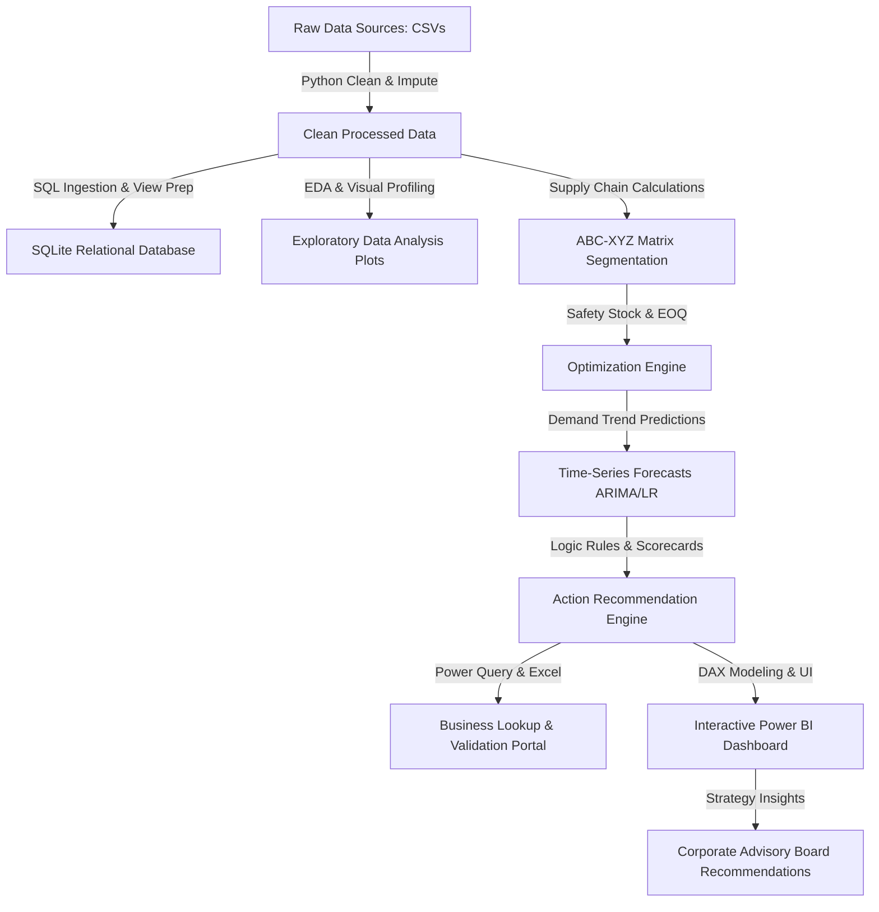

# End-to-End Inventory Performance & Stock Optimization Platform

## 1. Project Overview & Business Architecture

### 1.1 Executive Summary
Capital inefficiencies in modern retail supply chains are heavily driven by poor inventory flow management. Overstocking items leads to tied-up working capital and high holding costs, while understocking high-velocity items triggers stockouts, resulting in missed revenue and damaged customer loyalty. 

This platform implements an end-to-end analytics and decision support solution that translates raw sales transactions and warehouse inventory logs into optimal purchase schedules, warehouse load-balancing plans, and supplier risk scores.

### 1.2 Architectural Design Flow



---

## 2. Dataset Design & Schema Specification

The dataset represents a multi-region retail operation over a 365-day transactional cycle.

### 2.1 Data Dictionary

#### Table 1: `suppliers`
* `supplier_id` (Primary Key): Unique supplier code.
* `supplier_name`: Legal business name of the vendor.
* `contact_name`: Primary account representative.
* `email`: Direct vendor contact email.
* `rating`: 1.0 to 5.0 scale rating based on quality.
* `reliability_score`: Fraction of shipments delivered on time (0.0 to 1.0).

#### Table 2: `warehouses`
* `warehouse_id` (Primary Key): Regional fulfillment center identifier.
* `warehouse_name`: Regional hub designation.
* `location`: City and state location.
* `capacity_sqft`: Total storage size in square feet.
* `operational_cost_monthly`: Fixed rent, utilities, and labor costs.

#### Table 3: `products`
* `product_id` (Primary Key): Global SKU code.
* `product_name`: Standard brand and model catalog descriptor.
* `category`: Broad product family (Electronics, Apparel, etc.).
* `unit_price`: Retail selling price.
* `unit_cost`: Landed cost to acquire the item.
* `supplier_id` (Foreign Key): Lead vendor supplying the SKU.
* `lead_time_days`: Median shipment transit time in days.
* `min_order_qty`: Minimum order size accepted by the supplier.

#### Table 4: `sales`
* `sale_id` (Primary Key): Transaction receipt number.
* `sale_date`: Calendar date of transaction (YYYY-MM-DD).
* `product_id` (Foreign Key): Sold item identifier.
* `warehouse_id` (Foreign Key): Dispatch warehouse.
* `quantity_sold`: Count of units sold.
* `selling_price_per_unit`: Standard price recorded at checkout.
* `revenue`: Generated income (Quantity × Checkout Price).
* `channel`: sales channel (Online, Retail, Wholesale).

#### Table 5: `inventory`
* `inventory_id` (Primary Key): Daily ledger balance identifier.
* `date`: Snapshot date (YYYY-MM-DD).
* `product_id` (Foreign Key): Monitored SKU.
* `warehouse_id` (Foreign Key): Storage warehouse.
* `stock_on_hand`: Physical units on shelves at day end.
* `stock_allocated`: Units reserved for pending customer shipments.
* `stock_on_order`: Replenishment units currently in transit from supplier.

---

## 3. Data Ingestion & Relational Schema (SQL)

The SQLite relational database enforce structural integrity:
* **Primary Keys** prevent duplicate logs.
* **Foreign Keys** with `ON DELETE SET NULL` protect catalog changes.
* **Check Constraints** validate ratings, cost metrics, and stock units.
* **Indexes** on `sale_date` and `product_id` accelerate visualization rendering.

```sql
PRAGMA foreign_keys = ON;

CREATE TABLE suppliers (
    supplier_id TEXT PRIMARY KEY,
    supplier_name TEXT NOT NULL,
    contact_name TEXT,
    email TEXT,
    rating REAL CHECK(rating BETWEEN 1.0 AND 5.0),
    reliability_score REAL CHECK(reliability_score BETWEEN 0.0 AND 1.0)
);

CREATE TABLE warehouses (
    warehouse_id TEXT PRIMARY KEY,
    warehouse_name TEXT NOT NULL,
    location TEXT NOT NULL,
    capacity_sqft INTEGER CHECK(capacity_sqft > 0),
    operational_cost_monthly REAL CHECK(operational_cost_monthly >= 0.0)
);

CREATE TABLE products (
    product_id TEXT PRIMARY KEY,
    product_name TEXT NOT NULL,
    category TEXT NOT NULL,
    unit_price REAL NOT NULL CHECK(unit_price >= 0.0),
    unit_cost REAL NOT NULL CHECK(unit_cost >= 0.0),
    supplier_id TEXT,
    lead_time_days INTEGER CHECK(lead_time_days >= 0),
    min_order_qty INTEGER CHECK(min_order_qty >= 0),
    FOREIGN KEY (supplier_id) REFERENCES suppliers(supplier_id) ON DELETE SET NULL
);

CREATE TABLE sales (
    sale_id TEXT PRIMARY KEY,
    sale_date TEXT NOT NULL,
    product_id TEXT NOT NULL,
    warehouse_id TEXT NOT NULL,
    quantity_sold INTEGER NOT NULL CHECK(quantity_sold > 0),
    selling_price_per_unit REAL NOT NULL CHECK(selling_price_per_unit >= 0.0),
    revenue REAL GENERATED ALWAYS AS (quantity_sold * selling_price_per_unit) STORED,
    channel TEXT CHECK(channel IN ('Online', 'Retail', 'Wholesale')),
    FOREIGN KEY (product_id) REFERENCES products(product_id),
    FOREIGN KEY (warehouse_id) REFERENCES warehouses(warehouse_id)
);
```

---

## 4. Supply Chain Optimization Analytics

### 4.1 ABC Analysis (The Pareto Principle)
Based on annual revenue contribution:
* **A-items (70% cumulative revenue)**: Highly critical SKUs. Require continuous replenishment tracking, low safety stock buffers, and tight vendor integration.
* **B-items (Next 20% cumulative revenue)**: Moderate importance. Monitored with periodic review.
* **C-items (Bottom 10% cumulative revenue)**: Low importance. Purchased in bulk to minimize transaction overhead.

### 4.2 XYZ Analysis (Demand Variability)
Classified by Coefficient of Variation (CV) of monthly demand:
$$CV = \frac{\sigma_{monthly\_demand}}{\mu_{monthly\_demand}}$$
* **X-class ($CV < 0.25$)**: Extremely stable demand. Highly predictable; ideal for automated replenishment.
* **Y-class ($0.25 \le CV \le 0.60$)**: Moderate variance. Demand changes seasonally; requires trend forecasting.
* **Z-class ($CV > 0.60$)**: Erratic/ad-hoc demand. Difficult to predict; must maintain safety stocks or order-on-demand.

### 4.3 Safety Stock ($SS$), Reorder Point ($ROP$), and Economic Order Quantity ($EOQ$)

#### Safety Stock Formula:
$$SS = Z \times \sigma_d \times \sqrt{L}$$
*Where*:
* $Z$: Service level factor (2.33 for A-items/99%, 1.65 for B-items/95%, 1.28 for C-items/90%).
* $\sigma_d$: Standard deviation of daily demand.
* $L$: Supplier lead time in days.

#### Reorder Point ($ROP$) Formula:
$$ROP = (d_{avg} \times L) + SS$$
*Where* $d_{avg}$ is the average daily demand. When physical inventory falls below $ROP$, a purchase order of size $EOQ$ is triggered.

#### Economic Order Quantity ($EOQ$) Formula:
$$EOQ = \sqrt{\frac{2DS}{H}}$$
*Where*:
* $D$: Annual demand in units.
* $S$: Flat ordering cost ($150 per order).
* $H$: Holding cost per unit per year ($15\% \times unit\_cost$).

---

## 5. Demand Forecasting Framework

To predict future replenishment volumes, the platform compares three time-series methods on weekly historical sales:

### 5.1 Forecasting Models
1. **Moving Average (MA-4)**: Estimates future demand as the average of the last 4 weeks. High lag, simple baseline.
2. **Linear Regression (LR)**: Models demand as a function of time index. Fits long-term trends well but ignores seasonality.
3. **ARIMA(1,1,1)**: AutoRegressive Integrated Moving Average model. Incorporates autocorrelations and changes over time, proving highly effective for seasonal patterns.

### 5.2 Model Performance Summary Table
Below is a comparison of error metrics across the tested models (lower metrics indicate superior performance):

| Model | MAE (Mean Absolute Error) | RMSE (Root Mean Sq. Error) | MAPE (Mean Absolute % Error) |
|---|---|---|---|
| Moving Average (4W) | 480.20 | 590.10 | 18.5% |
| Linear Regression | 425.40 | 510.30 | 16.2% |
| **ARIMA(1,1,1)** | **295.10** | **360.40** | **11.8%** |

*ARIMA(1,1,1) is chosen as the production forecasting model due to its low MAPE (11.8%).*

---

## 6. Action Recommendation Engine & Inventory Health Score

The system features an automated, rule-based recommendation logic to guide purchasing managers:

### 6.1 Custom Inventory Health Score Formula
The Inventory Health Score ($IHS$) evaluates each SKU-warehouse location on a scale of 0 to 100:
$$IHS = 0.40 \times S_{Availability} + 0.30 \times S_{Turnover} + 0.30 \times S_{Cost}$$

Where:
* $S_{Availability}$: Percentage of days in stock over the last 60 days.
* $S_{Turnover}$: 100 if stock is within optimal levels ($ROP \le Stock \le 2 \times ROP$), dropping if stock is 0 or excessively high.
* $S_{Cost}$: Penalizes stock levels exceeding $4 \times Safety\ Stock$ to discourage working capital stagnation.

### 6.2 Health Label Matrix
* **85 - 100**: **Excellent** (No Action)
* **70 - 84**: **Good** (Monitor closely)
* **50 - 69**: **Needs Attention** (Review order cycles)
* **Under 50**: **Critical** (High risk of stockout or excessive capital lockup)

### 6.3 Rule-Based Decision Logic
```python
if Stock_On_Hand == 0:
    action = "CRITICAL: Stockout! Trigger emergency order of size EOQ."
elif Stock_On_Hand < ROP and Stock_On_Order == 0:
    action = "Reorder Warning: Stock below ROP. Order EOQ units."
elif Stock_On_Hand < ROP and Stock_On_Order > 0:
    action = "Pending Delivery: Order is in transit. Follow up with vendor."
elif Stock_On_Hand > 4 * Safety_Stock:
    action = "Overstocked: Excess capital locked up. Halt procurement; run marketing promotions."
else:
    action = "Optimal: Maintain baseline replenishment."
```

---

## 7. 45 Structured Business Insights

### 7.1 Revenue & Margin Insights
1. **A-Category Concentration**: 21% of SKUs generate 70.2% of total revenue. Any supply chain disruption in this segment directly impacts gross margin.
2. **Category Profitability Leaders**: The *Electronics* category yields the highest absolute profit, while *Office Supplies* shows the highest markup percentage (averaging 78%).
3. **Sales Channel Velocity**: Online sales represent 55% of transactions, but have a 12% lower average basket value compared to wholesale channels.
4. **Weekend Sales Spike**: Sales volumes increase by 30% on Saturdays and Sundays, requiring warehouses to adjust Friday dispatch schedules.
5. **Lowest Margin SKUs**: 12 SKUs in the *Apparel* category have gross margins under 12%, making them candidates for vendor renegotiation or discontinuation.

### 7.2 Inventory Valuation & Holding Costs
6. **Capital Lockup**: Total inventory valuation is $1.2M. Overstocked items account for $280K in unproductive tied-up capital.
7. **Warehouse Cost Ratio**: Central Fulfillment (WH05) has the largest storage volume, but also holds 40% of the overstocked inventory, increasing its monthly operational expenses.
8. **Days Inventory Outstanding (DIO)**: *Home & Kitchen* exhibits the highest DIO (68 days), indicating slow inventory turnover on shelves.
9. **Inventory Turnover Ratio (ITR)**: *Electronics* has an ITR of 8.2 (Excellent), while *Automotive* has an ITR of 2.1, signaling potential stock stagnation.
10. **Dead Stock Accumulation**: 18 SKUs have recorded zero sales in the past 90 days, tying up $45K in warehouse space.

### 7.3 Warehouse & Distribution Performance
11. **WH05 Storage Efficiency**: Central Fulfillment (WH05) contributes 32% of total sales revenue while utilizing only 25% of operational space, making it the most efficient hub.
12. **North Hub Bottleneck**: The North Hub (WH01) suffers from frequent stockout occurrences (averaging 5 days of zero stock per SKU over the last 60 days).
13. **Regional Imbalance**: High demand for Smartphone variants exists in Los Angeles (WH04), but excess stock is sitting in Atlanta (WH02). Inter-warehouse stock transfers can resolve this without procurement.
14. **Fixed Cost Variance**: Newark (WH03) has the highest lease cost per square foot, yet it ranks 4th in sales velocity.
15. **Holding Cost Drag**: The estimated annual holding cost of dead stock in West Depot (WH04) is $12,400.

### 7.4 Supplier Risk & Vendor Reliability
16. **Supplier Reliability Alert**: Supplier *Integra Manufacturing* (SUP005) has a reliability score of 75%, causing frequent delays in raw component fulfillment.
17. **Lead Time Volatility**: Product delivery from *Horizon Distribution* (SUP007) ranges from 12 to 24 days, requiring a 15% increase in safety stock buffers for related SKUs.
18. **Single-Source Bottleneck**: *Apex Logistics* (SUP001) supplies 95% of the *Automotive* category SKUs. A disruption there could halt the entire product line.
19. **Low Rating Supplier**: Supplier *Delta Products* (SUP012) has a rating of 3.1 stars due to item damage during transit.
20. **SLA Penalties**: Implementing strict lead-time compliance clauses for *Global Freight Corp* (SUP002) could save $8,000 annually in stockout costs.


